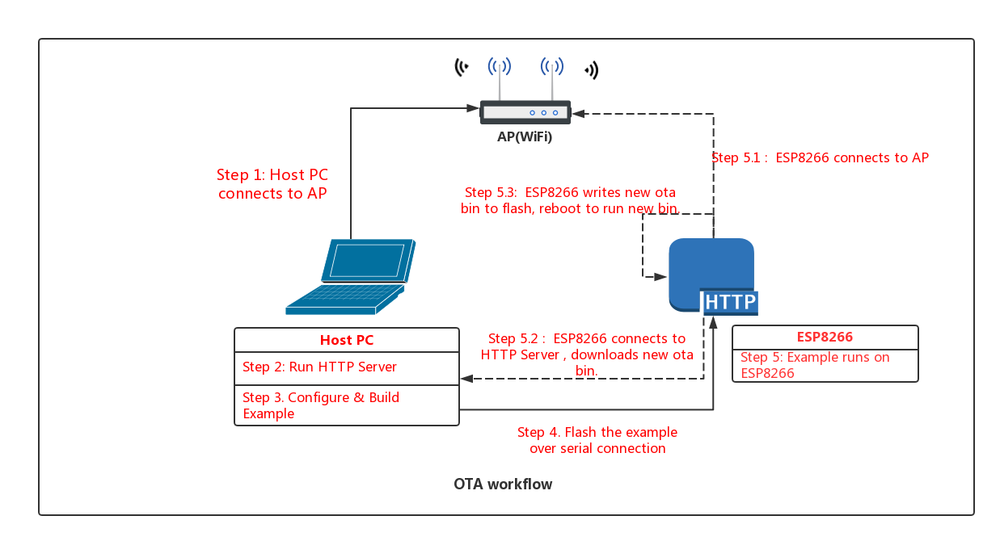

# Simple OTA Demo on ESP8266
This example demonstrates a working OTA (over the air) firmware update workflow.

---

# Introduce
there are two areas in flash for system to do OTA: user1 area and user2 area. they work same to each other, backup to each other.
for more OTA flash info, please look into [ESP8266 SDK
Getting Started Guide](https://www.espressif.com/sites/default/files/documentation/2a-esp8266-sdk_getting_started_guide_en.pdf)
 
# Aim
Flashing the example over serial with `esptool`. On first startup, the bootloader loads this user bin which then performs an OTA update (triggered in the example code). The update downloads a new user bin from a http server and saves it into the other  user bin area. At this point the example code does bin CRC check, prepare to reboot to run new user bin if CRC passed, then the bootloader reads new user bin and runs it.


# Workflow
The OTA_workflow.png diagram demonstrates the overall workflow:



## Step 1: Connect to AP
Connect your host PC to the same AP that you will use for the ESP8266.

## Step 2: Run HTTP Server
Python has a built-in HTTP server that can be used for example purposes.

For our upgrade example OTA file, we're going to use the `ESP8266_RTOS_SDK/bin/upgrade` to do a cycle OTA workflow.

Open a new terminal to run the HTTP server, then run these commands to build the example and start the server:

```
cd $SDK_PATH/bin/upgrade
python -m SimpleHTTPServer 3344
```

While the server is running, the contents of the directory can be browsed at http://127.0.0.1:3344

NB: On some systems, the command may be `python2 -m SimpleHTTPServer`.

If you have any firewall software running that will block incoming access to port 3344, configure it to allow access while running the example.

## Step 3: Build OTA Example
Before compile OTA demo, please change the following details in `include/ota.h` if necessary:

* WiFi SSID & Password
* IP address of your host PC as "HTTP Server"
* HTTP Port number (if using the Python HTTP server above, the default is correct)

Save your changes, and run `./gen_misc.sh` to build the example.

## Step 4: Flash OTA Example
When flashing, use the `esptool` firstly to erase the entire flash. Then flash the user bin over serial.


## Step 5: Run the OTA Example
When the example starts up, it will print "local OTA task started..." then demo will follow the steps automatically:

1. Connect to the AP with configured SSID and password.
2. Connect to the HTTP server and download the new user bin.
3. Write the new user bin to flash, and configure the next boot.
4. check the bin CRC
4. Reboot to run new user bin if CRC passed

# Troubleshooting
* Check your PC can ping the ESP8266 at its IP, and that the IP, AP and other configuration settings are correct in `ota.h`.
* Check if any firewall software is preventing incoming connections on the PC.

## Production Implementation

If scaling this example for production use, please consider:

* Dealing with timeouts or WiFi disconnections while flashing.

# Adapter to your OTA scene
if change the demo to your OTA environment, please notice the following details.  

1). OTA always was triggered passively, please change the necessary workflow to do OTA  
2). do a domain name resolution of OTA server by `netconn_gethostbyname` to fetch a OTA IP address in real scene  
3). must modify HTTP request according to your OTA server, you could use the firefox and wireshark to debug HTTP request  
- escape the URL path if necessary  
- there is always a slash at the beginning of the URL  
- support HTTP version: `HTTP/1.0` or `HTTP/1.1`  
- change `Host` item to your domain name/port according to your OTA server  
- OTA server should transmit a Content-Type `application/octet-stream` according to `Accept` item  
- OTA server should not encrypt the http body according to `Accept-Encoding` item  
- new use bin size is decided by `Content-Length` Item  
- `recv malformed http header` means that http server tranmits a http header item without `\r\n` end before ESP8266 receives the `\r\n\r\n`  
